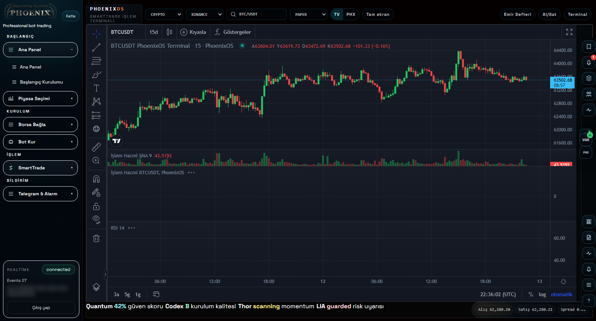
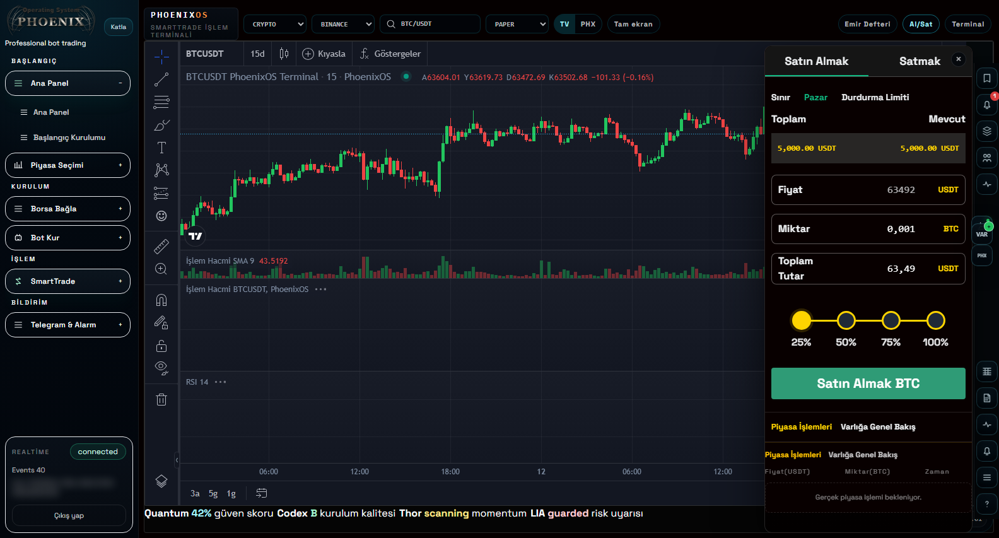

# Fycbit

Fycbit is a multi-service cryptocurrency exchange and trading platform
baseline containing a Laravel backend, Next.js web client, and Node.js wallet
service.

## Smart Trade Terminal

<p align="center">
  
</p>

The screenshot above is from the real Smart Trade terminal running with a
dedicated showcase account. The account contains synthetic PAPER funds only,
has no exchange API keys, and cannot represent a real customer portfolio.

<table>
  <tr>
    <td width="58%">
      
    </td>
    <td>
      <strong>Terminal capabilities</strong><br><br>
      TV and PHX chart engines<br>
      PAPER and permission-gated LIVE modes<br>
      Market, limit, and stop-limit order entry<br>
      Buy and sell position sizing<br>
      Order book and terminal panels<br>
      Drawing tools and indicator layers<br>
      Risk, alert, bot, and Telegram modules<br>
      Strategy testing and replay debugger
    </td>
  </tr>
</table>

Smart Trade also provides order preview, submission and cancellation,
paper-position closing, indicator and script management, backtest results,
signal timelines, watchlists, layouts, snapshots, market screeners, heatmaps,
news, risk controls, and replay inspection for variables, signals, order
intents, runtime logs, data gaps, and repaint reports.

> Screenshots are promotional captures from a synthetic showcase account.
> Identifiers are obscured and no customer, credential, KYC, exchange-key, or
> production-balance data is included.

Public website: [fycbit.com](https://fycbit.com/)

Turkce ayrintili urun ve ozellik tanitimi:
[Fycbit Platform Tanitimi](docs/PRODUCT_OVERVIEW_TR.md).

> This software is not financial advice. Cryptocurrency trading and custody
> involve substantial risk. This public baseline is not represented as
> production-ready, audited, or suitable for custody of real assets.

## Repository Layout

| Path | Description |
| --- | --- |
| `apps/backend` | Laravel API, jobs, migrations, modules, and tests |
| `apps/web` | Next.js web client |
| `apps/wallet-service` | Node.js wallet integration service |
| `docs` | Installation, architecture, operations, and security guides |

## Current Status

This is a sanitized review baseline. Production credentials, `.env` files,
database dumps, TLS keys, KYC/user data, uploads, logs, dependency folders, and
runtime build output are excluded.

The software has not completed an independent security, custody, smart
contract, financial, or compliance audit. Use testnet/devnet and synthetic data
only.

## Quick Start

Prerequisites: PHP 8.x, Composer, Node.js, MySQL, and Redis.

```bash
git clone --branch staging-publication --single-branch https://github.com/FadilAltunkaynak/Fycbit.git
cd Fycbit
cp .env.example apps/backend/.env
cd apps/backend
composer install
php artisan key:generate
php artisan migrate
php artisan serve
```

In another terminal:

```bash
cd apps/web
npm ci
npm run dev
```

These are development instructions only. Review
[Installation](docs/INSTALLATION.md) before running any service.

The public baseline does not include production data, uploads, secrets, or
compiled assets. A successful source installation is not a production
deployment or custody approval.

## Security

Never commit exchange keys, wallet keys, seed phrases, signing material,
payment credentials, SMTP credentials, KYC records, user exports, database
dumps, or production configuration. See [SECURITY.md](SECURITY.md).

## Documentation

- [Installation](docs/INSTALLATION.md)
- [Turkce ayrintili kurulum](docs/INSTALLATION_TR.md)
- [Environment reference](docs/ENVIRONMENT_REFERENCE.md)
- [Troubleshooting](docs/TROUBLESHOOTING.md)
- [Glossary](docs/GLOSSARY.md)
- [Backup and restore](docs/BACKUP_AND_RESTORE.md)
- [Production readiness](docs/PRODUCTION_READINESS.md)
- [Feature matrix](docs/FEATURE_MATRIX.md)
- [Architecture](docs/ARCHITECTURE.md)
- [Configuration](docs/CONFIGURATION.md)
- [Operations](docs/OPERATIONS.md)
- [Public release checklist](docs/PUBLIC_RELEASE_CHECKLIST.md)
- [Wiki index](docs/WIKI.md)

## License

No broad public-use license has been granted yet. See [LICENSE.md](LICENSE.md)
and [LICENSE_DECISION_REQUIRED.md](LICENSE_DECISION_REQUIRED.md). Third-party
components remain governed by their respective licenses.
